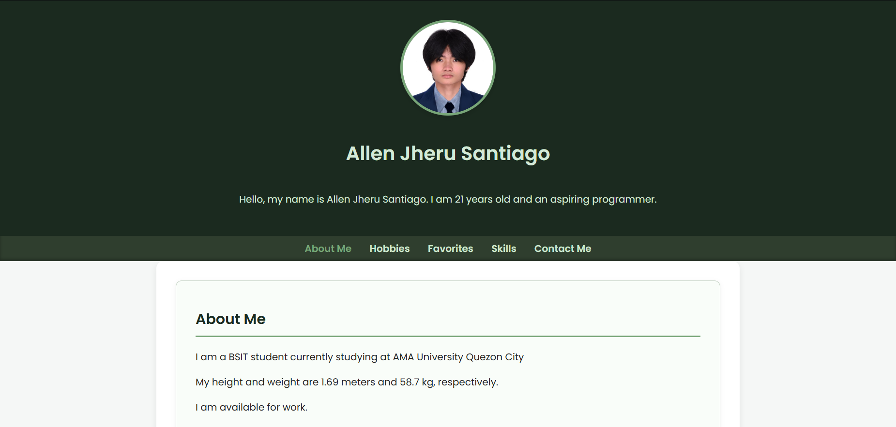

# 🌱 Allen Jheru Santiago (22013022410)- Personal Portfolio

Welcome to my simple personal portfolio website built using **basic PHP**, **HTML**, **CSS**, and **JavaScript**. This project is part of a learning activity to demonstrate how PHP works with front-end technologies and apply foundational web development concepts.

---

## 📄 Features

- ✅ Homepage with introduction
- ✅ About Me, Hobbies, and Favorites sections
- ✅ Skills & Technologies section
- ✅ Responsive profile image with hover animation
- ✅ Contact section with clickable email and phone number
- ✅ Responsive layout with media queries
- ✅ Smooth scroll navigation

---

## 🛠 Technologies Used

- **PHP (Basic syntax, comments, variables, echo/print, data types)**
- **HTML5**
- **CSS3** with media queries and transitions
- **Vanilla JavaScript** for interactivity

---

## 📁 Project Structure

my-portfolio/
├── index.php # Main entry file
├── css/
│ └── style.css # Stylesheet
├── js/
│ └── script.js # JavaScript for smooth scroll & log
├── images/
│ └── profile.jpg # profile image
├── includes/ # Reusable PHP components
│ ├── header.php
│ ├── nav.php
│ ├── main.php
│ ├── footer.php
└── README.md # This file

---

## 🧪 PHP Concepts Demonstrated

- ✅ Basic PHP syntax
- ✅ Single-line and multi-line comments
- ✅ Case sensitivity of variables
- ✅ Variable declaration and data types (string, int, float, boolean, array)
- ✅ String concatenation using `.` operator
- ✅ `echo` usage
- ✅ PHP inside HTML
- ✅ Dynamic date (`date("Y")`)

---

## 🖼 Preview



---

## 📧 Contact Me

- **Email:** [allenjherussantiago@gmail.com](mailto:allenjherussantiago@gmail.com)
- **Phone:** [tel:+639202105915](tel:+639202105915)

---

## ⚙️ How to Run

1. Make sure you have **PHP installed** on your machine.
2. Clone this repository or download the ZIP.
3. Open a terminal inside the folder and run:

   ```bash
   php -S localhost:8000
   
4. Open your browser and go to:
   http://localhost:8000

---

## 💡 Notes
This project is for learning/demo purposes and doesn’t use a backend or database.

## 📝 License
This project is for educational purposes and free to use or modify.
